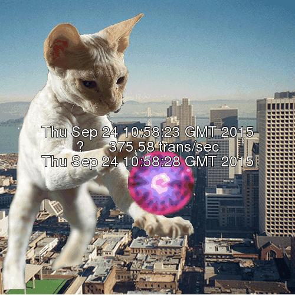

Catz
===


Simple, naive wrapper around:

 * ImageMagick
 * siege
 * mutt

to run some load tests against a host and email the results as a gif of a cat.

Thats kinda it.

Invocation
---

```bash
$ CONCURRENT=250 TIME=15m ENVIRONMENT=prod ./cat_runner
```

Environment
---

CONCURRENT: Number of concurrent users to simulate

TIME: Length of time to run as; accepts a unit

ENVIRONMENT: This actually translates as `${ENVIRONMENT}_urls`; a file containing urls to hit

EMAIL: The address to email results to

Notes
---

Environment files are stored at ~/.catz/

Example Output
--


